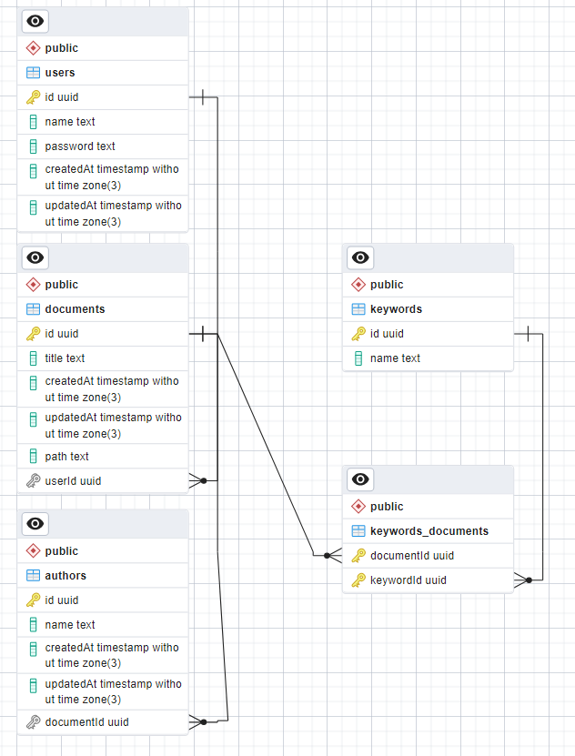

# Repositório de TCCS - Backend

## Tecnologias utilizadas 
- NodeJS
- Typescript
- NestJS
- Prisma
- Postgres SQL

## Explicações
O NestJS é um framework que busca construir servidores escaláveis, enquanto adere a metodologia de programação orientada a objetos. Nele, portanto, o foco é feito utilizando os paradigmas de injeção de dependências, inversão de dependências, decorators, etc. Ao mesmo tempo, ele também adere partes da programação funcional.
Dessa maneira, o NestJS se torna um exemplo perfeito para a criação de um servidor HTTP que trabalhe com os paradigmas estudados em Engenharia de Software.

A inversão de dependências torna o desenvolvimento muito mais fácil e rápido, além de facilitar a manutenção. A criação do controller de um módulo, por exemplo, dependerá diretamente do seu service ao invés do service depender do controller. Tal fato facilita possíveis alterações no código, uma vez que apenas uma parte deve ser mexida e todas que dependem dessa classe passarão a ter o novo comportamento. 
Com o auxilio do decorator @Injectable() do NestJS, é possível trabalhar com a injeção de dependências, principio fundamental do SOLID onde cada classe trabalha a partir de contratos umas com as outras. Esse decorator realiza todo o trabalho de instanciar os objetos de cada classe e injetar nos respectivos lugares que possuem as dependências.

O banco de dados utilizado foi o Postgres SQL com o auxílio do Prisma como ORM para facilitar a programação. O ORM, ao mesmo tempo que facilita fazer as queries no banco de dados, acaba gerando queries não tão otimizadas quanto aquelas que seriam feita na mão. No entanto, por ser um projeto simples, não é algo que vai influenciar muito.

O banco de dados possui a seguinte estrutura:

É um estrutura simples que permite o registro e busca facilmente de cada documento por seus autores e/ou palavras-chaves/temas. O banco foi construído, como dito, com o Postgres por ser um banco rápido e fácil de se utilizar, além de ser open-source.

## Possíveis testes
- Teste unitários
- Teste E2E
- Teste de validação
- Entre outros

Se der tempo, alguns testes serão implementados. Os arquivos de testes presentes são aqueles gerados automaticamente pelo Nest.

## Como rodar o servidor:
Primeiro de tudo é necessário possui o NodeJS em sua máquina. Após isso, abra a pasta do projeto e execute "npm install" ou "yarn" dependendo do seu gerenciador de pacotes. Caso seja a primeira vez usando o NodeJS, o único disponível será o "npm install"
Após isso, crie um arquivo .env seguindo os exemplos do arquivo de .env.example. Use a sua string de conexao com o banco no lugar do DATABASE_URL, além de colocar alguma string aleatória para o JWT_SECRET. Após isso, execute "npx prisma migrate dev" e em seguida "npx prisma generate".

Com sucesso, você poderá executar "npm start" e o servidor começará a ser executado em http://localhost:3000